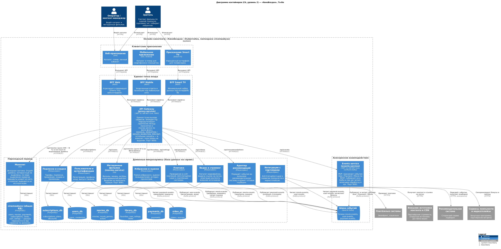
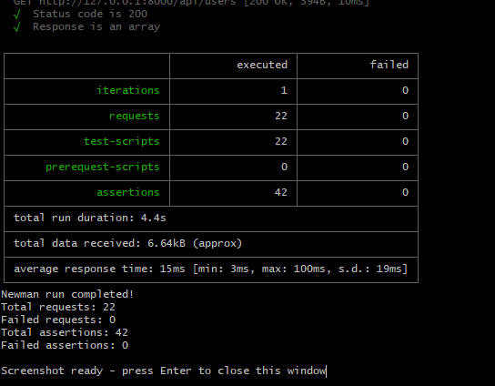
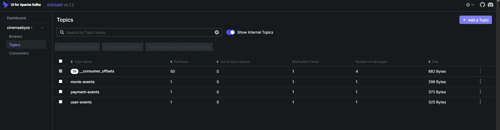
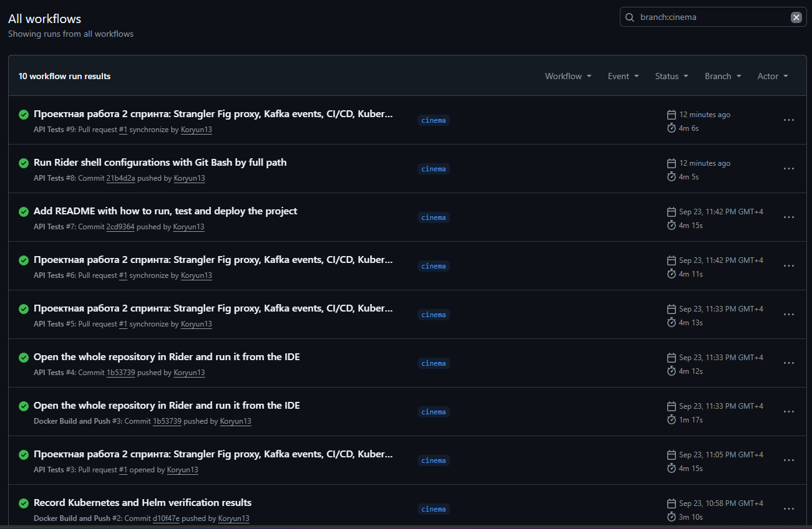
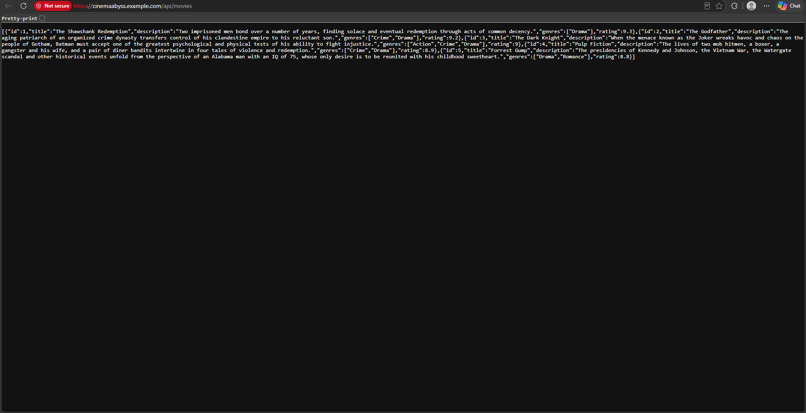
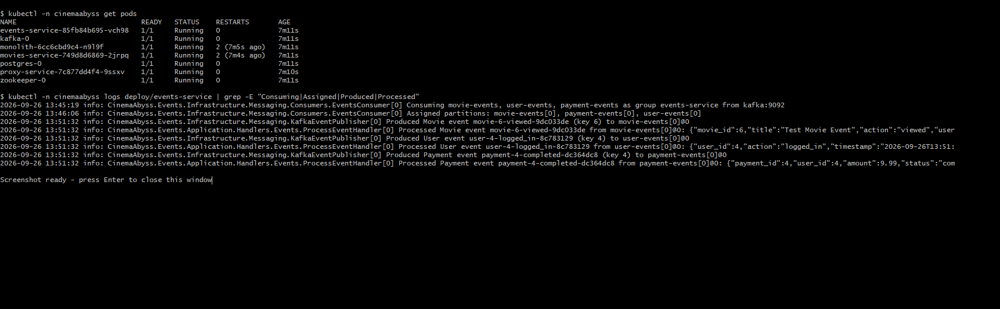
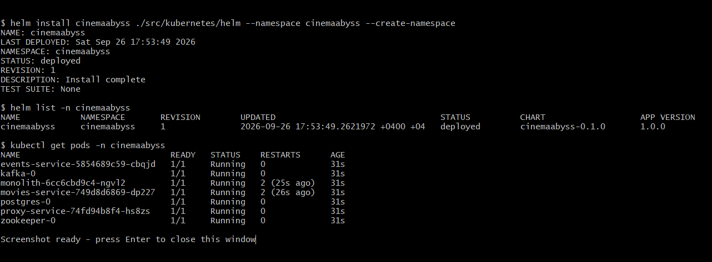
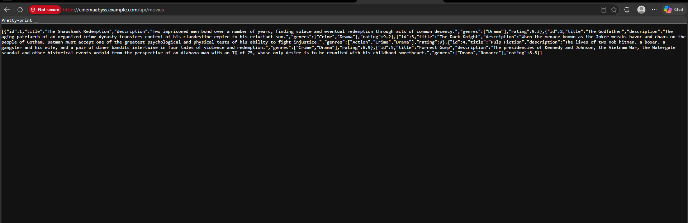

## Изучите [README.md](./README-правка.md) файл и структуру проекта.

Новые сервисы проекта — **proxy-service** и **events-service** — написаны на **.NET 10 / ASP.NET Core**
(C#, Minimal API). Монолит и сервис movies остались на Go в том виде, в каком их выделила команда:
именно их proxy постепенно «душит» по паттерну Strangler Fig.

| Компонент | Путь | Стек | Порт |
|---|---|---|---|
| Монолит | `src/monolith` | Go (без изменений) | 8080 |
| Movies service | `src/microservices/movies` | Go (без изменений) | 8081 |
| **Events service** | `src/microservices/events` | .NET 10, Confluent.Kafka | 8082 |
| **Proxy service (API Gateway)** | `src/microservices/proxy` | .NET 10, YARP | 8000 |

Оба .NET-сервиса устроены одинаково: один проект на сервис, слои — папки
(`Domain` → `Application` → `Infrastructure` → `Presentation`), один тип — один файл,
`Program.cs` — короткий composition root, эндпойнты — модули `IEndpointModule`.
Решение открывается файлом `CinemaAbyss.slnx`; `dotnet build CinemaAbyss.slnx` собирает оба
сервиса (предупреждения считаются ошибками).

# Задание 1

1. Спроектируйте to be архитектуру КиноБездны, разделив всю систему на отдельные домены и организовав интеграционное взаимодействие и единую точку вызова сервисов.
Результат представьте в виде контейнерной диаграммы в нотации С4.
Добавьте ссылку на файл в этот шаблон

### Решение

[Диаграмма контейнеров To-Be (C4, PlantUML)](docs/c4/cinemaabyss-containers-to-be.puml) ·
[PNG](docs/c4/CinemaAbyss_Containers_ToBe.png) · [SVG](docs/c4/CinemaAbyss_Containers_ToBe.svg)



Ключевые решения:

- **Домены** (у каждого своя БД — database per service): пользователи и аутентификация;
  метаданные фильмов (movies-service, уже выделен); избранное и оценки; видео и стриминг;
  подписки и скидки; платежи; интеграции с партнёрами (лояльность, маркетплейсы);
  адаптер внешней рекомендательной системы.
- **Единая точка вызова** — API Gateway (proxy-service). Перед ним — Backend for Frontend
  на каждый тип клиента (веб, мобильные, Smart TV), потому что интерфейсы и объём данных на
  разных устройствах различаются.
- **Strangler Fig**: gateway направляет в выделенный сервис только его маршруты, всё
  остальное — в монолит. Домен покидает монолит, получая собственный маршрут; когда маршрутов
  не остаётся, монолит и общая БД выводятся из эксплуатации.
- **Интеграционное взаимодействие**: синхронно — REST через gateway; асинхронно — события в
  Kafka (`movie-events`, `user-events`, `payment-events`). Так, подписки продлеваются по
  событию успешного платежа, бонусы начисляются по событиям платежей и пользователей, а
  рекомендательная система получает события просмотров и оценок, не нагружая синхронный путь.
- **Внешние системы** (платёжные системы, сервисы лояльности, маркетплейсы) подключаются через
  Anti-Corruption Layer в отдельных сервисах, чтобы их модели не проникали в домен.

# Задание 2

### 1. Proxy
Команда КиноБездны уже выделила сервис метаданных о фильмах movies и вам необходимо реализовать бесшовный переход с применением паттерна Strangler Fig в части реализации прокси-сервиса (API Gateway), с помощью которого можно будет постепенно переключать траффик, используя фиче-флаг.

#### Решение

Сервис: [`src/microservices/proxy`](src/microservices/proxy) — .NET 10 + [YARP](https://github.com/dotnet/yarp).
Конфигурация запуска в `docker-compose.yml` использована без изменений (переменные `PORT`,
`MONOLITH_URL`, `MOVIES_SERVICE_URL`, `EVENTS_SERVICE_URL`, `GRADUAL_MIGRATION`,
`MOVIES_MIGRATION_PERCENT`).

Маршрутизация ([`RouteTable`](src/microservices/proxy/Infrastructure/Routing/RouteTable.cs)):

| Путь | Куда |
|---|---|
| `GET /health` | отвечает сам proxy: `Strangler Fig Proxy is healthy` |
| `/api/movies/**` | монолит или movies-service — по фиче-флагу |
| `/api/events/**` | events-service |
| всё остальное (`/api/users`, `/api/payments`, `/api/subscriptions`, …) | монолит |

Фиче-флаг ([`MoviesMigrationPolicy`](src/microservices/proxy/Domain/Policies/MoviesMigrationPolicy.cs)):

- `GRADUAL_MIGRATION=true` — `MOVIES_MIGRATION_PERCENT` процентов запросов `/api/movies`
  уходят в movies-service, остальные — в монолит (для каждого запроса случайное число 0–99
  сравнивается с процентом);
- `GRADUAL_MIGRATION=false` — перенос завершён, весь трафик домена идёт в movies-service
  (как описано в README).

Выбор между монолитом и movies-service реализован как политика балансировки YARP
([`StranglerFigLoadBalancingPolicy`](src/microservices/proxy/Infrastructure/Routing/StranglerFigLoadBalancingPolicy.cs)):
у кластера movies два адресата, и политика выбирает одного из них. Каждое решение пишется в
лог, а в ответ добавляется заголовок `X-Upstream-Service` с именем обслужившего сервиса — так
распределение трафика видно снаружи. Некорректные значение флага или процента останавливают
сервис при старте с понятным сообщением.

Проверка:

```bash
docker compose up -d --build
curl -i http://localhost:8000/api/movies        # заголовок X-Upstream-Service: monolith | movies-service

# распределение при MOVIES_MIGRATION_PERCENT=50
for i in $(seq 1 200); do curl -s -o /dev/null -D - http://localhost:8000/api/movies \
  | grep -i x-upstream-service; done | sort | uniq -c
```

Результаты проверки: 50 % → 111 монолит / 89 movies-service из 200 запросов; 0 % → все
запросы в монолит; 100 % → все в movies-service; `GRADUAL_MIGRATION=false` → все в
movies-service. Процент меняется в `docker-compose.yml`, после чего proxy пересоздаётся:
`docker compose up -d proxy-service`.

Postman-тесты (`cd tests/postman && npm install && npm run test:local`): **22 запроса,
42 проверки, 0 ошибок** — включая тесты events.



### 2. Kafka
 Вам как архитектуру нужно также проверить гипотезу насколько просто реализовать применение Kafka в данной архитектуре.

Для этого нужно сделать MVP сервис events, который будет при вызове API создавать и сам же читать сообщения в топике Kafka.

#### Решение

Сервис: [`src/microservices/events`](src/microservices/events) — .NET 10 +
[Confluent.Kafka](https://github.com/confluentinc/confluent-kafka-dotnet). Сервис
`events-service` в `docker-compose.yml` уже был описан; добавлены только политика
перезапуска и зависимость от Kafka (вместо ненужной зависимости от PostgreSQL).

API соответствует `api-specification.yaml`:

| Метод | Путь | Топик |
|---|---|---|
| `GET` | `/api/events/health` | — (`{"status": true}`) |
| `POST` | `/api/events/movie` | `movie-events` |
| `POST` | `/api/events/user` | `user-events` |
| `POST` | `/api/events/payment` | `payment-events` |

- **Producer** ([`KafkaEventPublisher`](src/microservices/events/Infrastructure/Messaging/KafkaEventPublisher.cs)):
  `acks=all` и идемпотентность; ключ сообщения — id фильма, пользователя или платежа, поэтому
  события одной сущности попадают в одну партицию и читаются по порядку. Ответ `201` содержит
  `partition` и `offset`, которые подтвердил брокер. Если брокер недоступен, через 5 секунд
  возвращается `500 {"error": ...}`.
- **Consumer** ([`EventsConsumer`](src/microservices/events/Infrastructure/Messaging/Consumers/EventsConsumer.cs)):
  фоновый сервис в той же программе подписан на все три топика (group `events-service`) и
  передаёт каждое событие в
  [`ProcessEventHandler`](src/microservices/events/Application/Handlers/Events/ProcessEventHandler.cs),
  который пишет его в лог. Offset сохраняется после обработки (at-least-once).
- **Валидация** — обязательные поля схем проверяет сам сериализатор: нет поля или `null` →
  `400 {"error": ...}` с именем поля.
- OpenAPI: `http://localhost:8082/openapi/v1.json`, Scalar UI: `http://localhost:8082/scalar`.

Пример лога обработки:

```text
info: ...KafkaEventPublisher Produced Movie event movie-8-viewed-dbfb6e32 (key 8) to movie-events[0]@1
info: ...ProcessEventHandler Processed Movie event movie-8-viewed-dbfb6e32 from movie-events[0]@1: {"movie_id":8,"title":"Test Movie Event","action":"viewed","user_id":5}
info: ...ProcessEventHandler Processed User event user-5-logged_in-8f375d9c from user-events[0]@1: {"user_id":5,"action":"logged_in",...}
info: ...ProcessEventHandler Processed Payment event payment-5-completed-0d4aa47b from payment-events[0]@1: {"payment_id":5,"user_id":5,"amount":9.99,...}
```

Вывод по гипотезе: подключение Kafka к архитектуре оказалось простым — отдельный сервис,
официальный клиент и три топика, которые брокер создаёт сам (`KAFKA_CREATE_TOPICS`).
Остальные сервисы можно переводить на события по одному, не меняя синхронные контракты.

Состояние топиков в Kafka UI (http://localhost:8090):



# Задание 3

Команда начала переезд в Kubernetes для лучшего масштабирования и повышения надежности.
Вам, как архитектору осталось самое сложное:
 - реализовать CI/CD для сборки прокси сервиса
 - реализовать необходимые конфигурационные файлы для переключения трафика.

### CI/CD

#### Решение

[`.github/workflows/docker-build-push.yml`](.github/workflows/docker-build-push.yml):

- добавлены шаги метаданных и сборки/публикации образов **events-service** и
  **proxy-service** (контексты `./src/microservices/events` и `./src/microservices/proxy`);
- сборка запускается и на рабочей ветке `cinema`, чтобы образы оказались в registry до
  слияния PR;
- actions обновлены до актуальных версий, у каждого образа свой scope кэша GitHub Actions.

[`.github/workflows/api-tests.yml`](.github/workflows/api-tests.yml): запускается и на ветке
`cinema`; `actions/setup-node` обновлён до v4 — npm-кэш v3 работал через устаревший кэш-сервис
GitHub, который отключён, и шаг падал.

`docker-compose.yml`: монолит и movies-service ждут готовности PostgreSQL
(`condition: service_healthy`) и перезапускаются при сбое. Без этого Go-сервисы завершались
при старте раньше, чем база начинала принимать соединения, и api-tests падали.

Образы: `ghcr.io/koryun13/architecture-cinemaabyss/{monolith,movies-service,events-service,proxy-service}`.



### Proxy в Kubernetes

#### Шаг 1

- В `src/kubernetes/*.yaml` (monolith, movies-service, events-service, proxy-service) указаны
  образы `ghcr.io/koryun13/architecture-cinemaabyss/<service>:latest`.
- `src/kubernetes/dockerconfigsecret.yaml`: образы публичные, поэтому секрет `dockerconfigjson`
  **намеренно не содержит учётных данных** (base64 от `{"auths":{}}`) — персональный токен
  нельзя коммитить в публичный репозиторий. Для приватных образов секрет создаётся из токена
  с правом `read:packages`:

  ```bash
  kubectl -n cinemaabyss create secret docker-registry dockerconfigjson \
    --docker-server=ghcr.io --docker-username=<login> --docker-password=<PAT>
  ```

#### Шаг 2

- [`src/kubernetes/proxy-service.yaml`](src/kubernetes/proxy-service.yaml) — Deployment
  (порт 8000, пробы `/health`, переменные из ConfigMap) и Service `proxy-service:80 → 8000`.
- [`src/kubernetes/events-service.yaml`](src/kubernetes/events-service.yaml) — Deployment
  (порт 8082, пробы `/api/events/health`, `KAFKA_BROKERS` из ConfigMap) и Service
  `events-service:8082`.
- [`src/kubernetes/configmap.yaml`](src/kubernetes/configmap.yaml) — добавлены
  `EVENTS_SERVICE_URL` и `KAFKA_BROKERS`. Процент переключения задаётся в
  `MOVIES_MIGRATION_PERCENT`, после изменения:
  `kubectl -n cinemaabyss rollout restart deployment/proxy-service`.
- [`src/kubernetes/ingress.yaml`](src/kubernetes/ingress.yaml) — `/` → `proxy-service:80`
  (единая точка входа), `/api/events` → `events-service:8082`. Вместо устаревшей аннотации
  `kubernetes.io/ingress.class` используется `ingressClassName: nginx`.

Порядок развёртывания:

```bash
kubectl apply -f src/kubernetes/namespace.yaml
kubectl apply -f src/kubernetes/configmap.yaml
kubectl apply -f src/kubernetes/secret.yaml
kubectl apply -f src/kubernetes/dockerconfigsecret.yaml
kubectl apply -f src/kubernetes/postgres-init-configmap.yaml
kubectl apply -f src/kubernetes/postgres.yaml
kubectl apply -f src/kubernetes/kafka/kafka.yaml
kubectl apply -f src/kubernetes/monolith.yaml
kubectl apply -f src/kubernetes/movies-service.yaml
kubectl apply -f src/kubernetes/events-service.yaml
kubectl apply -f src/kubernetes/proxy-service.yaml
minikube addons enable ingress
kubectl apply -f src/kubernetes/ingress.yaml
# /etc/hosts: 127.0.0.1 cinemaabyss.example.com
minikube tunnel
cd tests/postman && npm run test:kubernetes
```

#### Шаг 3

Вывод https://cinemaabyss.example.com/api/movies:



Логи events-service после тестов:



# Задание 4
Для простоты дальнейшего обновления и развертывания вам как архитектуру необходимо так же реализовать helm-чарты для прокси-сервиса и проверить работу

#### Решение

- [`values.yaml`](src/kubernetes/helm/values.yaml): пути всех образов заменены на
  `ghcr.io/koryun13/architecture-cinemaabyss/*`; `imagePullSecrets.dockerconfigjson` — секрет
  без учётных данных (см. задание 3), для приватных образов передаётся при установке через
  `--set`; добавлен `config.kafkaBrokers`; у Ingress удалена аннотация
  `kubernetes.io/ingress.class` — вместе с `className` (он рендерит `spec.ingressClassName`) она
  приводила к отказу API-сервера создать Ingress.
- [`templates/services/proxy-service.yaml`](src/kubernetes/helm/templates/services/proxy-service.yaml)
  и [`templates/services/events-service.yaml`](src/kubernetes/helm/templates/services/events-service.yaml) —
  Deployment и Service, параметризованные из `values.yaml` по образцу monolith и movies-service.
  Аннотация `checksum/config` перезапускает поды при изменении ConfigMap, так что новый
  `moviesMigrationPercent` применяется одним `helm upgrade`.
- [`templates/configmap.yaml`](src/kubernetes/helm/templates/configmap.yaml): исправлен
  `MOVIES_SERVICE_URL` (было `http://movies:8081` — такого Service нет, правильно
  `movies-service`), добавлены `EVENTS_SERVICE_URL` и `KAFKA_BROKERS`.

`helm lint` проходит без ошибок, `helm template` рендерит все ресурсы.

```bash
helm install cinemaabyss ./src/kubernetes/helm --namespace cinemaabyss --create-namespace
kubectl get pods -n cinemaabyss
minikube tunnel
# переключение трафика без правки файлов:
helm upgrade cinemaabyss ./src/kubernetes/helm -n cinemaabyss --reuse-values \
  --set config.moviesMigrationPercent=50
```





## Удаляем все

```bash
kubectl delete all --all -n cinemaabyss
kubectl delete namespace cinemaabyss
```
