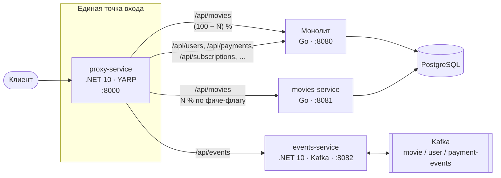

# «КиноБездна» — переход от монолита к микросервисам

Проектная работа 2 спринта: бесшовный вывод доменов из монолита на Go по паттерну
**Strangler Fig**, проверка **Kafka** как шины событий, **CI/CD** в GitHub Actions,
развёртывание в **Kubernetes** вручную и через **Helm**.

Решения по заданиям описаны в [`Project_template.md`](Project_template.md).

[](https://github.com/Koryun13/architecture-cinemaabyss/actions/workflows/docker-build-push.yml)
[](https://github.com/Koryun13/architecture-cinemaabyss/actions/workflows/api-tests.yml)

## Содержание

- [Архитектура](#архитектура)
- [Стек и структура](#стек-и-структура)
- [Быстрый старт (Docker Compose)](#быстрый-старт-docker-compose)
- [Strangler Fig: переключение трафика](#strangler-fig-переключение-трафика)
- [Kafka и events-service](#kafka-и-events-service)
- [Тесты](#тесты)
- [Запуск и отладка из Rider](#запуск-и-отладка-из-rider)
- [Kubernetes (minikube)](#kubernetes-minikube)
- [Helm](#helm)
- [CI/CD](#cicd)
- [Скрипты `deploy/`](#скрипты-deploy)
- [Частые проблемы](#частые-проблемы)

## Архитектура



- **proxy-service** — API Gateway. Маршрут `/api/movies` делится между монолитом и
  movies-service по фиче-флагу, остальное пока обслуживает монолит.
- **events-service** — MVP событийного взаимодействия: API публикует события в Kafka, и тот же
  сервис читает их и пишет обработку в лог.
- Целевая (To-Be) архитектура всей системы — диаграмма контейнеров C4:
  [`docs/c4/cinemaabyss-containers-to-be.puml`](docs/c4/cinemaabyss-containers-to-be.puml)
  ([PNG](docs/c4/CinemaAbyss_Containers_ToBe.png)).

## Стек и структура

| Компонент | Путь | Стек | Порт |
|---|---|---|---|
| Proxy service (API Gateway) | `src/microservices/proxy` | .NET 10, ASP.NET Core, YARP | 8000 |
| Events service | `src/microservices/events` | .NET 10, ASP.NET Core, Confluent.Kafka | 8082 |
| Монолит | `src/monolith` | Go (исходный) | 8080 |
| Movies service | `src/microservices/movies` | Go (выделен командой) | 8081 |
| PostgreSQL | `src/database/init.sql` | PostgreSQL 14 | 5432 |
| Kafka + ZooKeeper | `docker-compose.yml` | wurstmeister/kafka 2.7 | 9092 (в сети), 9093 (с хоста) |
| Kafka UI | `docker-compose.yml` | provectuslabs/kafka-ui | 8090 |

```
.
├── .github/workflows/     CI: сборка образов, API-тесты
├── .run/                  конфигурации запуска Rider
├── deploy/                скрипты запуска, тестов, Kubernetes и Helm
├── docs/c4/               диаграмма контейнеров To-Be
├── src/
│   ├── database/          схема и тестовые данные PostgreSQL
│   ├── kubernetes/        манифесты Kubernetes и Helm-чарт (helm/)
│   ├── microservices/
│   │   ├── events/        .NET 10 — Kafka producer/consumer
│   │   ├── movies/        Go — метаданные фильмов
│   │   └── proxy/         .NET 10 — Strangler Fig API Gateway
│   └── monolith/          Go — исходный монолит
├── tests/postman/         Postman-коллекция и окружения (Newman)
├── api-specification.yaml OpenAPI всей системы
├── CinemaAbyss.slnx       решение для Rider / Visual Studio
└── docker-compose.yml
```

.NET-сервисы устроены одинаково: один проект на сервис, слои — папки
`Domain` → `Application` → `Infrastructure` → `Presentation`, один тип — один файл,
`Program.cs` — короткий composition root. Каждый проект самодостаточен (контекст сборки образа —
папка сервиса), предупреждения компилятора считаются ошибками.

## Быстрый старт (Docker Compose)

Нужны Docker Desktop (или Docker Engine с Compose v2) и, для тестов, Node.js 18+.

```bash
docker compose up -d --build          # 8 контейнеров
docker compose ps                     # proxy и events становятся (healthy)
```

| Адрес | Что там |
|---|---|
| http://localhost:8000/api/movies | фильмы через API Gateway |
| http://localhost:8000/health | `Strangler Fig Proxy is healthy` |
| http://localhost:8082/scalar | документация API events-service (Scalar) |
| http://localhost:8090 | Kafka UI: топики и сообщения |

Остановить и удалить данные:

```bash
docker compose down -v
```

> Монолит и movies-service ждут готовности PostgreSQL (`condition: service_healthy`), поэтому
> первые секунд 10–20 после `up` они в статусе «Created» — это нормально.

## Strangler Fig: переключение трафика

Поведение proxy задают переменные окружения:

| Переменная | Значение |
|---|---|
| `GRADUAL_MIGRATION=true` | `MOVIES_MIGRATION_PERCENT` % запросов `/api/movies` идут в movies-service, остальные — в монолит |
| `GRADUAL_MIGRATION=false` | перенос завершён: весь `/api/movies` идёт в movies-service |
| `MOVIES_MIGRATION_PERCENT` | 0–100; в compose по умолчанию 50, в Kubernetes 100 |
| `MONOLITH_URL`, `MOVIES_SERVICE_URL`, `EVENTS_SERVICE_URL` | адреса бэкендов |

Каждый ответ содержит заголовок **`X-Upstream-Service`** (`monolith` или `movies-service`),
а каждое решение пишется в лог proxy, так что распределение видно снаружи:

```bash
curl -i http://localhost:8000/api/movies | grep -i x-upstream-service

bash deploy/traffic-split.sh                 # 200 запросов → сколько ушло в каждый бэкенд
bash deploy/compose-migration.sh 75          # пересоздать только proxy с 75 % и сразу проверить
docker logs -f cinemaabyss-proxy-service     # GET /api/movies -> movies-service (roll 18, …)
```

Некорректные значения (например, `MOVIES_MIGRATION_PERCENT=150`) останавливают proxy при старте
с понятным сообщением.

## Kafka и events-service

| Метод | Путь | Топик |
|---|---|---|
| `GET` | `/api/events/health` | — |
| `POST` | `/api/events/movie` | `movie-events` |
| `POST` | `/api/events/user` | `user-events` |
| `POST` | `/api/events/payment` | `payment-events` |

```bash
curl -X POST http://localhost:8082/api/events/movie \
  -H 'Content-Type: application/json' \
  -d '{"movie_id": 1, "title": "Inception", "action": "viewed", "user_id": 1}'
# 201 {"status":"success","partition":0,"offset":0,"event":{"id":"movie-1-viewed-…",…}}

docker logs cinemaabyss-events-service | grep -E "Produced|Processed"
```

- Ответ содержит `partition` и `offset`, подтверждённые брокером (`acks=all`, идемпотентный
  producer). Ключ сообщения — id сущности, поэтому её события читаются по порядку.
- Consumer в том же сервисе (group `events-service`) читает все три топика и пишет каждое
  событие в лог; offset фиксируется после обработки (at-least-once).
- Обязательные поля из `api-specification.yaml` проверяет сериализатор: нет поля или `null` →
  `400 {"error": "..."}`; брокер недоступен → через 5 с `500 {"error": "..."}`.

## Тесты

Postman-коллекция `tests/postman` запускается через Newman: 22 запроса, 42 проверки.

```bash
bash deploy/postman-tests.sh local        # на localhost-портах (docker compose)
bash deploy/postman-tests.sh docker       # из контейнера в сети compose — так же, как в CI
bash deploy/postman-tests.sh kubernetes   # через Ingress: нужны hosts и minikube tunnel
bash deploy/postman-tests-in-cluster.sh   # через Ingress из пода — без hosts и tunnel
```

Или вручную: `cd tests/postman && npm install && npm run test:local`.
JUnit-отчёты складываются в `tests/postman/reports/` (HTML-отчёт появится, если установить
`newman-reporter-htmlextra`: `run-tests.js` уже запрашивает его).

## Запуск и отладка из Rider

Откройте **`CinemaAbyss.slnx`**: в нём весь репозиторий — .NET-проекты, исходники Go,
Dockerfile, compose, манифесты Kubernetes, Helm-чарт, workflow и тесты.

Конфигурации запуска из `.run/` появятся в списке Run, сгруппированные по папкам:

| Папка | Конфигурации |
|---|---|
| 1. Docker Compose | `docker-compose up` · `infrastructure + legacy` · `down -v` · смена процента · traffic split |
| 2. .NET services | `CinemaAbyss.Proxy: http` · `CinemaAbyss.Events: http` · `proxy + events (local)` |
| 3. Tests | Postman local · docker (as CI) · kubernetes · kubernetes (in-cluster) |
| 4. Kubernetes and Helm | apply manifests · delete all · helm install or upgrade · helm 50 % · minikube tunnel · traffic split |

**Отладка proxy и events с точками останова:**

1. «docker-compose infrastructure + legacy» — PostgreSQL, Kafka, Kafka UI, монолит и
   movies-service в контейнерах.
2. «proxy + events (local)» (Run или Debug) — оба .NET-сервиса из исходников на тех же портах
   8000 и 8082; их `launchSettings.json` указывают на `localhost`.
3. «tests: postman local» — прогон тестов через запущенные из IDE сервисы.

Kafka в compose публикует два listener'а: `kafka:9092` для контейнеров и `localhost:9093` для
сервисов, запущенных на хосте, — поэтому events-service из IDE работает с тем же брокером.

Shell-конфигурации выполняют `bash deploy/*.sh` (на Windows — Git Bash). После установки
kubectl, helm или minikube перезапустите Rider, чтобы он увидел обновлённый `PATH`.

## Kubernetes (minikube)

Нужны minikube, kubectl и Helm 3.2+ (на Windows: `winget install Kubernetes.minikube` и
`winget install Helm.Helm`).

```bash
minikube start --driver=docker --cpus=4 --memory=6144
bash deploy/k8s-apply.sh          # манифесты из src/kubernetes в правильном порядке + ingress
```

Скрипт повторяет шаги из `Project_template.md`: namespace → ConfigMap и секреты → PostgreSQL →
Kafka → монолит → movies-service → events-service → proxy-service → Ingress, и ждёт, пока все
7 подов станут Running:

```
events-service-…   1/1   Running
kafka-0            1/1   Running
monolith-…         1/1   Running
movies-service-…   1/1   Running
postgres-0         1/1   Running
proxy-service-…    1/1   Running
zookeeper-0        1/1   Running
```

Ingress: `/` → `proxy-service:80`, `/api/events` → `events-service:8082`, хост
`cinemaabyss.example.com`. Чтобы открыть его в браузере:

1. Добавьте в hosts (от администратора; на Windows —
   `C:\Windows\System32\drivers\etc\hosts`): `127.0.0.1 cinemaabyss.example.com`
2. `bash deploy/minikube-tunnel.sh` — держите запущенным.
3. Откройте https://cinemaabyss.example.com/api/movies.

Процент переключения задаётся в `src/kubernetes/configmap.yaml` (`MOVIES_MIGRATION_PERCENT`),
после изменения: `kubectl -n cinemaabyss rollout restart deployment/proxy-service`.

Образы берутся из `ghcr.io/koryun13/architecture-cinemaabyss/*` (публичные). Секрет
`dockerconfigjson` поэтому не содержит учётных данных; для приватных образов создайте его из
токена с правом `read:packages`:

```bash
kubectl -n cinemaabyss create secret docker-registry dockerconfigjson \
  --docker-server=ghcr.io --docker-username=<login> --docker-password=<PAT>
```

Удалить всё: `bash deploy/k8s-delete.sh`.

## Helm

```bash
bash deploy/k8s-delete.sh                  # если стоит ручная установка
bash deploy/helm-install.sh                # helm upgrade --install по values.yaml
bash deploy/helm-install.sh 50             # переключить 50 % /api/movies обратно на монолит
```

То же без скриптов:

```bash
helm install cinemaabyss ./src/kubernetes/helm --namespace cinemaabyss --create-namespace
helm upgrade cinemaabyss ./src/kubernetes/helm -n cinemaabyss --reuse-values \
  --set config.moviesMigrationPercent=50
helm uninstall cinemaabyss -n cinemaabyss
```

Основные параметры `src/kubernetes/helm/values.yaml`:

| Параметр | По умолчанию | Назначение |
|---|---|---|
| `config.moviesMigrationPercent` | `100` | доля `/api/movies`, идущая в movies-service |
| `config.gradualMigration` | `true` | фиче-флаг постепенного перехода |
| `config.kafkaBrokers` | `kafka:9092` | брокер для events-service |
| `<service>.image.repository` / `.tag` | `ghcr.io/koryun13/architecture-cinemaabyss/<service>` / `latest` | образы сервисов |
| `imagePullSecrets.dockerconfigjson` | без учётных данных | секрет для ghcr.io |

Изменение ConfigMap меняет аннотацию `checksum/config` у proxy и events, поэтому `helm upgrade`
сам перезапускает их поды — новый процент применяется одной командой.

## CI/CD

| Workflow | Когда | Что делает |
|---|---|---|
| [`docker-build-push.yml`](.github/workflows/docker-build-push.yml) | push в `main` или `cinema` (изменения в `src/**`), релиз, вручную | собирает и публикует 4 образа в ghcr.io: `latest`, ветка, короткий sha, semver для релизов |
| [`api-tests.yml`](.github/workflows/api-tests.yml) | push в `main`/`cinema`, pull request в `main`, вручную | поднимает `docker compose` и прогоняет Postman-тесты в сети compose |

## Скрипты `deploy/`

| Скрипт | Аргументы | Что делает |
|---|---|---|
| `compose-down.sh` | — | `docker compose down -v` |
| `compose-migration.sh` | процент | пересоздаёт proxy с новым процентом и показывает распределение |
| `traffic-split.sh` | [URL] [N] | N запросов к `/api/movies`, подсчёт по `X-Upstream-Service` |
| `postman-tests.sh` | `local` \| `docker` \| `kubernetes` | Postman-тесты в выбранном окружении |
| `postman-tests-in-cluster.sh` | — | тесты окружения kubernetes из пода в кластере |
| `k8s-apply.sh` | — | ручное развёртывание манифестов и ingress |
| `k8s-delete.sh` | — | удаляет Helm-релиз (если есть) и namespace |
| `helm-install.sh` | [процент] | установка или обновление чарта |
| `minikube-tunnel.sh` | — | `minikube tunnel` для доступа по `cinemaabyss.example.com` |

Каждый скрипт проверяет, что нужные утилиты есть в `PATH`, и останавливается на первой ошибке.

## Частые проблемы

| Симптом | Причина и решение |
|---|---|
| `port is already allocated` при `docker compose up` | порты 8000/8080–8082/5432 заняты другим стеком — остановите его (`docker compose stop` в его папке) |
| events-service пишет `Subscribed topic not available` в первые секунды | Kafka ещё создаёт топики; consumer повторяет попытку сам |
| Kafka в Kubernetes: `InconsistentClusterIdException` | остались данные прошлой установки: `bash deploy/k8s-delete.sh` (удаляет PVC вместе с namespace) и установите заново |
| monolith/movies-service в Kubernetes перезапускаются 1–3 раза | ждут готовности PostgreSQL — это ожидаемо, затем Running |
| shell-конфигурация Rider: `'helm' is not on PATH` | утилита установлена после запуска IDE — перезапустите Rider |
| `ImagePullBackOff` | образы ещё не опубликованы CI или стали приватными — проверьте GitHub Packages |
